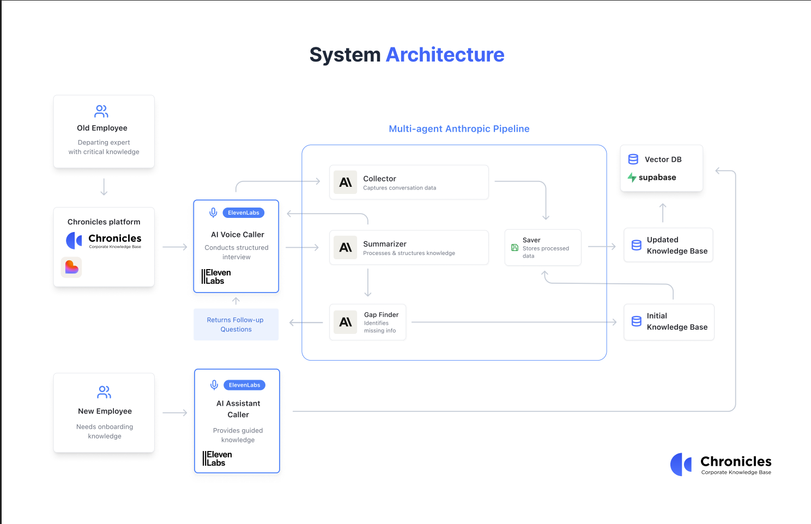

# 📚 Chronicles - AI-Powered Knowledge Management System

<div align="center">

[](https://chronicles-c28jtcidc-shubham-s-projects-bb8334fc.vercel.app)
[](https://reactjs.org/)
[](https://www.typescriptlang.org/)
[](https://vitejs.dev/)
[](LICENSE)

*Transform conversations into organized knowledge with AI-powered insights*

[🚀 Live Demo](https://chronicles-c28jtcidc-shubham-s-projects-bb8334fc.vercel.app) • [📖 Documentation](#documentation) • [🤝 Contributing](#contributing)

## 📸 Screenshots & Architecture

<div align="center">

</div>

<div align="center">

</div>

</div>

## ✨ Features

### 🎙️ **Real-time Conversation Detection**
- Automatically detects when ElevenLabs conversations end
- Real-time conversation monitoring and event handling
- Smart popup notifications for completed sessions

### 📊 **Knowledge Base Management**
- Organized story categorization system
- AI-powered content analysis and insights
- Interactive knowledge gap identification
- Advanced search and filtering capabilities

### 🔄 **Conversation Sync**
- Seamless ElevenLabs integration with API wrapper
- Transcript capture and processing
- Conversation metadata extraction
- Real-time sync with knowledge base

### 🤖 **AI-Powered Features**
- Intelligent conversation summarization
- Key topic extraction
- Knowledge gap analysis
- Smart content suggestions

### 🎨 **Modern UI/UX**
- Beautiful shadcn/ui component library
- Responsive design with Tailwind CSS
- Dark/light theme support
- Intuitive navigation and user experience

## 🛠️ Tech Stack

### Frontend
- **React 18** - Modern UI library with hooks
- **TypeScript** - Type-safe development
- **Vite** - Lightning-fast build tool
- **Tailwind CSS** - Utility-first CSS framework
- **shadcn/ui** - Beautiful component library
- **React Router** - Client-side routing
- **React Query** - Server state management

### Backend & Services
- **Vercel** - Serverless deployment platform
- **Supabase** - Backend-as-a-Service database
- **ElevenLabs API** - AI conversation platform
- **OpenAI API** - AI text processing and embeddings

### Development Tools
- **ESLint** - Code linting and quality
- **Concurrently** - Run multiple scripts
- **React Hook Form** - Form state management
- **Zod** - Schema validation

## 🚀 Quick Start

### Prerequisites
- Node.js 18+ and npm
- ElevenLabs API account
- Supabase project (optional)
- OpenAI API key (optional, for embeddings)

### 1. Clone & Install
```bash
git clone https://github.com/Susmithareddya/Chronicles.git
cd Chronicles
npm install
```

### 2. Environment Setup
```bash
# Copy environment template
cp .env.example .env

# Edit .env with your API keys
VITE_ELEVEN_LABS_API_KEY=your-elevenlabs-api-key
VITE_OPENAI_API_KEY=your-openai-api-key
VITE_SUPABASE_URL=your-supabase-url
VITE_SUPABASE_ANON_KEY=your-supabase-key
```

### 3. Development Server
```bash
# Start development server
npm run dev

# Or start with API routes (recommended)
npm run dev:api

# Or start both frontend and API
npm run dev:full
```

### 4. Proxy Server (Optional)
For enhanced ElevenLabs integration:
```bash
cd server
npm install
npm start
```

Visit `http://localhost:5173` to start using Chronicles!

## 📁 Project Structure

```
Chronicles/
├── 📁 src/
│   ├── 📁 components/          # Reusable UI components
│   │   ├── ConversationSync*.tsx    # Conversation management
│   │   ├── KnowledgeBase*.tsx       # Knowledge base UI
│   │   └── ui/                      # shadcn/ui components
│   ├── 📁 pages/               # Route components
│   │   ├── Index.tsx                # Main dashboard
│   │   ├── ConversationSync.tsx     # Sync interface
│   │   └── KnowledgeGaps.tsx        # Gap analysis
│   ├── 📁 services/            # API and business logic
│   │   ├── conversationDetectionService.ts
│   │   ├── elevenlabsService.ts
│   │   └── supabaseClient.ts
│   └── 📁 lib/                 # Utilities and configurations
├── 📁 server/                  # Proxy server (optional)
├── 📁 api/                     # Vercel serverless functions
└── 📁 public/                  # Static assets
```

## 🎯 Core Features Deep Dive

### Conversation Detection Service
Real-time monitoring of ElevenLabs conversations with automatic event handling:

```typescript
const detectionService = new ConversationDetectionService();
const unsubscribe = detectionService.addEventListener((event) => {
  if (event.status === 'ended') {
    // Handle conversation completion
    processConversation(event.conversationId);
  }
});
```

### Knowledge Base Dashboard
Interactive dashboard for managing and exploring your knowledge:
- **Story Cards**: Visual representation of conversations
- **Category Filtering**: Organize by topics and themes
- **Search**: Find specific conversations quickly
- **Analytics**: Insights into conversation patterns

### ElevenLabs Integration
Comprehensive API wrapper for ElevenLabs services:
- Conversation retrieval and management
- Transcript processing and analysis
- Real-time status monitoring
- Error handling and retry logic

## 🔧 Configuration

### Environment Variables
| Variable | Description | Required |
|----------|-------------|----------|
| `VITE_ELEVEN_LABS_API_KEY` | ElevenLabs API authentication | ✅ |
| `VITE_OPENAI_API_KEY` | OpenAI API for embeddings | 🟡 |
| `VITE_SUPABASE_URL` | Supabase project URL | 🟡 |
| `VITE_SUPABASE_ANON_KEY` | Supabase anonymous key | 🟡 |
| `VITE_USE_PROXY` | Use proxy server mode | ❌ |
| `VITE_PROXY_URL` | Proxy server URL | ❌ |

### Development Scripts
```bash
npm run dev          # Start Vite development server
npm run dev:api      # Start Vercel dev server with API routes
npm run dev:full     # Start both frontend and API concurrently
npm run build        # Production build
npm run build:dev    # Development build
npm run lint         # Run ESLint
npm run preview      # Preview production build
```

## 🚀 Deployment

### Vercel (Recommended)
Chronicles is optimized for Vercel deployment:

```bash
# Install Vercel CLI
npm i -g vercel

# Deploy to production
vercel --prod
```

### Environment Variables on Vercel
Add these environment variables in your Vercel dashboard:
- `VITE_ELEVEN_LABS_API_KEY`
- `VITE_OPENAI_API_KEY` (optional)
- `VITE_SUPABASE_URL` (optional)
- `VITE_SUPABASE_ANON_KEY` (optional)

## 🧪 Testing & Development

### Available Test Features
- **Conversation Sync Tester**: Test ElevenLabs integration
- **WebSocket Bypass**: Direct API testing
- **Webhook Tester**: Test event handling
- **Quick Test Button**: Rapid development testing

### Development Mode Features
```javascript
// Test conversation popup (dev only)
window.testConversationPopup();
```

## 📊 API Routes

### Vercel Serverless Functions
- `/api/elevenlabs/conversations` - Fetch conversations
- `/api/elevenlabs/agents` - List available agents
- `/api/elevenlabs/conversation/[id]` - Get specific conversation

### Health Check
- `/api/health` - Service status and connectivity

## 🤝 Contributing

We welcome contributions! Please follow these steps:

1. **Fork** the repository
2. **Create** a feature branch: `git checkout -b feature/amazing-feature`
3. **Commit** your changes: `git commit -m 'Add amazing feature'`
4. **Push** to the branch: `git push origin feature/amazing-feature`
5. **Open** a Pull Request

### Development Guidelines
- Follow TypeScript best practices
- Use existing component patterns
- Maintain consistent code style with ESLint
- Test your changes thoroughly
- Update documentation as needed

## 📝 License

This project is licensed under the MIT License - see the [LICENSE](LICENSE) file for details.

## 🙋‍♂️ Support

- **Issues**: [GitHub Issues](https://github.com/Susmithareddya/Chronicles/issues)
- **Discussions**: [GitHub Discussions](https://github.com/Susmithareddya/Chronicles/discussions)
- **Email**: [Contact](mailto:your-email@example.com)

## 🎉 Acknowledgments

- [shadcn/ui](https://ui.shadcn.com/) for the beautiful component library
- [ElevenLabs](https://elevenlabs.io/) for the powerful conversation AI platform
- [Vercel](https://vercel.com/) for seamless deployment
- [Supabase](https://supabase.com/) for backend infrastructure

---

<div align="center">

**Built with ❤️ by the Chronicles team**

[⭐ Star this repo](https://github.com/Susmithareddya/Chronicles) if you find it helpful!

</div>
